# Гитхабификация Информационной Безопасности

*На пути к открытой, независимой от производителя и приветствующей вклад сообщества модели для ускорения обучения в сфере Информационной Безопасности*

8 декабря 2019 года

Джон Ламберт (John Lambert), @JohnLaTwC, Distinguished Engineer, Microsoft Threat Intelligence Center

## Аннотация

Объединение специалистов по Информационной Безопасности в рамках глобального сообщества позволяет ускорить обучение в предметной области.

Знания об атаках, собираемые в рамках MITRE ATT&CK™, совместно с логикой обнаружения угроз, описанной правилами Sigma и воспроизводимым анализом, описанным в Jupyter Notebooks, образуют упорядоченный набор практик. Эти практики связывают знания с аналитикой и анализом.

Если бы организации вносили свой вклад и делились своим уникальным опытом, а также опирались на опыт других членов сообщества, используя вышеперечисленные инструменты, то специалисты ИБ в каждой организации могли бы воспользоваться преимуществами лучших методов защиты.

## Введение

> *"Если хочешь идти быстро — иди один, если хочешь идти далеко — идите вместе." — Африканская пословица*

Никогда еще так остро не ощущалась необходимость в опытных специалистах информационной безопасности. Каждая организация стремится самостоятельно защититься от целенаправленных атак, вспышек криптовымогателей и других угроз. Считается что, требуется 10 000 часов для того, чтобы стать экспертом. И никуда не деться от того факта, что информационная безопасность — это профессия, в которой мастерство достигается за счет времени, потраченного на обработку алертов, изучение угроз и реагирование на инциденты. Если и есть отрасль, которая может выиграть от резкого сокращения времени, необходимого для овладения мастерством, то это — информационная безопасность.

Возможно ли это в условиях постоянной конкуренции коммерческих решений, разнородных и возрастающих по сложности технологий и коммерческих тайн? В настоящее время в индустрии информационной безопасности становится все более распространенным открытый подход, который может дать специалистами ИБ необходимое ускорение.

В данной статье описывается, как специалисты ИБ могут учиться вместе и выигрывать время, расширяя свои навыки. Таким образом, каждый специалист может быть настолько хорош, насколько хороши лучшие специалисты. Я называю этот подход "Гитхабификация Информационной безопасности". Он состоит из трех компонентов: знание, аналитика и анализ. Давайте рассмотрим каждый из них и разберем их ценность на конкретных примерах.

## Организованное знание

> *"Глаз не может видеть то, чего не знает разум" — многие*

Защита начинается с осведомленности. В сфере информационной безопасности принято распространять информацию о новых угрозах и техниках проведения атак. Но отсутствие организованности превращает попытки сообщить что-то новое в информационный шум. Следить за трендами, отсеивать лишнее и выбирать то что действительно важно — это очень серьезная задача. На текущий момент каждому специалисту приходится решать эту задачу самостоятельно.

Одним из наиболее существенных вкладов в информационную безопасность, с целью изменить сложившуюся ситуацию, вносит фреймворк MITRE ATT&CK™. Он представляет собой классификацию тактик и техник атак, которые используют злоумышленники. Рассмотрим технику "Специальные возможности Windows" с идентификатором [T1015](https://attack.mitre.org/techniques/T1015/). Она включает в себя общее описание, примеры использования преступными группировками, способы обнаружения и предотвращения вредоносной активности с использованием данной техники, а также ссылки на публикации с дополнительной информацией.

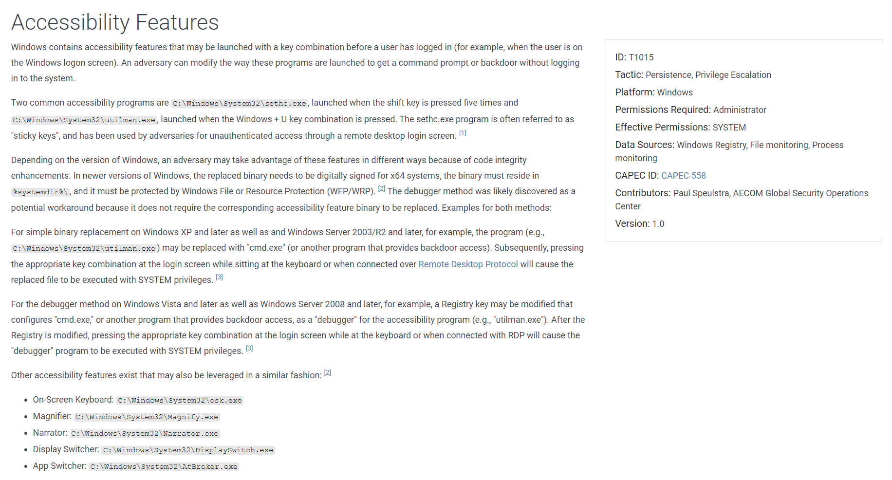
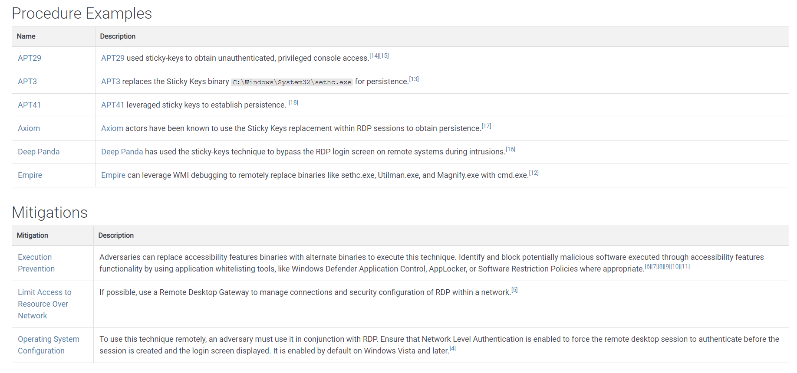
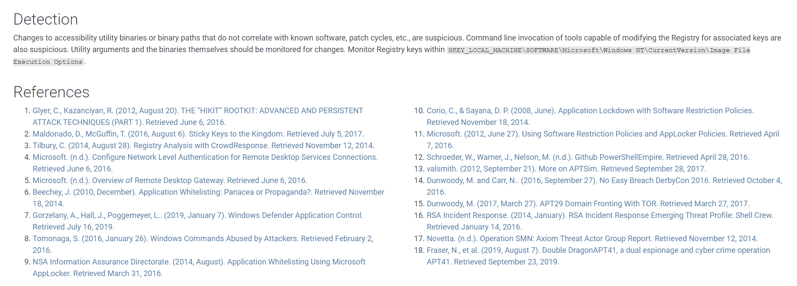

MITRE ATT&CK позволяет упростить распространение знаний посредством следующих принципов:

* Организованность. ATT&CK упрощает задачу, упорядочивая техники, основываясь на целях атакующего, группируя похожие техники вместе и соотнося их с затронутыми платформами (операционные системы, облачные технологии, системы АСУ ТП и многие другие).
* Открытость. ATT&CK приветствует вклад сообщества. В последнем обновлении большинство новых техник были разработаны исследователями, не являющимися сотрудниками корпорации MITRE. ATT&CK документирует техники, наблюдаемые в реальных атаках (а не только в теоретически возможные), поэтому вовлечение сообщества является необходимым шагом, поскольку исследователи из разных стран сталкиваются с разными атаками.
* Расширяемость. Самая популярная версия ATT&CK предназначена для корпоративных инфраструктур, но уже сейчас ведется работа по адаптации ATT&CK к облачным технологиям, мобильным платформам, интернету вещей, АСУ ТП и сетевым устройствам. Это значительно упрощает специалистам ИБ процесс освоения новых областей.

Многие исследователи и большинство ведущих производителей систем  информационной безопасности уже взяли на вооружение этот фреймворк. Вот несколько способов его использования:

* ATT&CK описывает преступные группы с помощью используемых ими техник. Специалисты ИБ могут оценить эффективность своих средств защиты против подмножества техник, используемых конкретными преступными группами. Вот пример от компании Palo Alto, который описывает техники ATT&CK преступной группы [Sofacy](https://pan-unit42.github.io/playbook_viewer/?pb=sofacy):
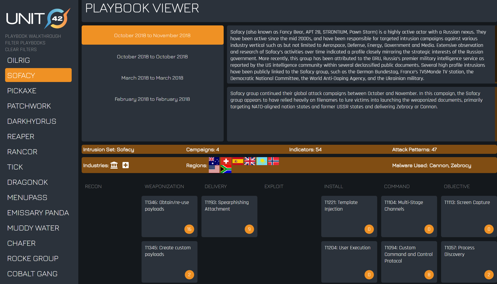
* Инструмент [ATT&CK Navigator](https://mitre-attack.github.io/attack-navigator/enterprise/) от MITRE позволяет увидеть сходства и различия преступных групп, подсвечивая используемые ими техники. В этом примере показан APT 28 (оранжевым цветом) и дополнительные техники APT 29:
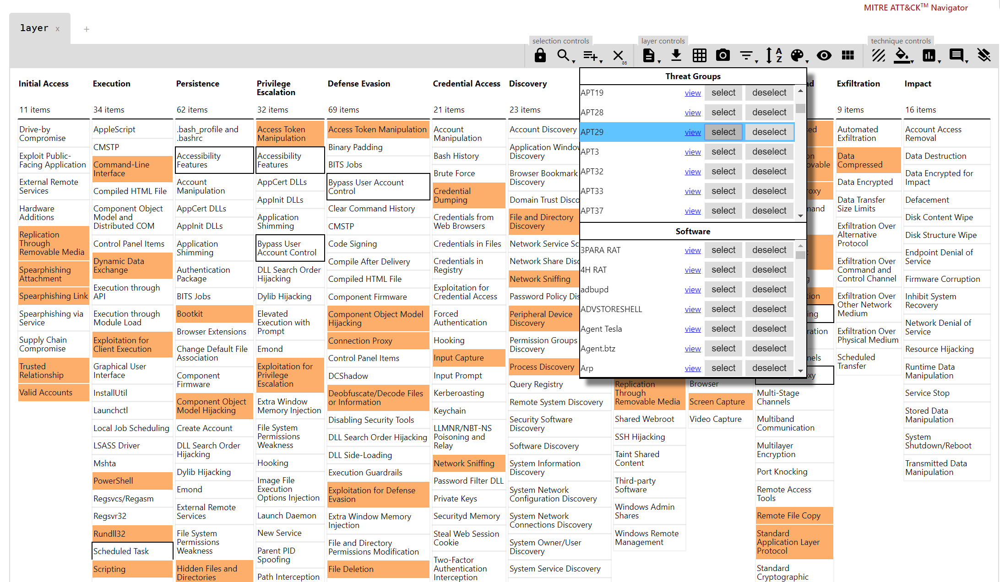
* Другой проект с открытым исходным кодом — [Atomic Red Team](https://redcanary.com/atomic-red-team/) от компании Red Canary, представляет собой тесты для симуляции техник описанных в ATT&CK. В основе проекта лежит принцип "доверяй, но проверяй", позволяющий специалистам ИБ заранее находить "слепые зоны" в своих системах защиты и обнаружения угроз. Ниже приведено покрытие матрицы ATT&CK тестами Atomic Red Team, представленными в проекте на момент написания статьи (выделены красным):

Таким образом, MITRE ATT&CK — это хранилище информации о техниках атакующих, которое помогает специалистам ИБ повысить уровень готовности к противодействию реальным, релевантным угрозам.

## Действенная Аналитика

> *"Каждый контакт оставляет след" — принцип обмена Локарда.*

Знания — это здорово, но это только первый шаг. Специалистам ИБ нужно уметь превращать эти знания в защитные меры. Одним из примеров является поиск следов вредоносной активности в логах различных систем. Специалисты выстраивают системы мониторинга, изучая основные модели данных и способы превращения идей по обнаружению угроз в конкретные поисковые запросы или "правила корреляции". Давайте рассмотрим данный процесс на примере одной из техник MITRE ATT&CK.

Техника T1015, к которой мы обращались ранее, включает в себя установку ключей реестра для утилит специальных возможностей, которые изменяют штатное исполнение на запуск этих утилит под отладчиком. Данные ключи позволяют установить на место отладчика утилиту cmd.exe, таким образом, вместо запуска отладчика, winlogon.exe запустит терминал с привилегиями SYSTEM на экране приветствия (входа). После этого злоумышленник сможет сбросить пароль и получить полный доступ к системе.

После того, как специалист ИБ изучит теорию об этой технике, ему необходимо будет определить способ ее обнаружения на практике, в реальной инфраструктуре. Обычно для этого нужно написать правило обнаружения на языке используемого инструмента для анализа логов (SIEM/LM системы) в соответствии с используемой в нем моделью данных.

Каждый инструмент имеет свой собственный язык: Splunk использует Search Processing Language (SPL), ElasticSearch — Domain Specific Language (DSL), а Microsoft Defender ATP — Keyword Query Language (KQL). Если бы только существовал универсальный язык для поиска в логах, такой как Yara для файлов и Snort для сетевого трафика...

Проект [Sigma](https://github.com/Neo23x0/sigma), нацеленный на решение данной задачи, стал популярным в последние годы. Sigma — это проект с открытым исходным кодом, созданный Флорианом Ротом ([@cyb3rops](https://twitter.com/cyb3rops)) и Томасом Патцке ([@blubbfiction](https://twitter.com/blubbfiction)), который представляет собой общий формат правил обнаружения угроз ("корреляции") с помощью логов. Он включает в себя набор конвертеров, которые переводят правила обнаружения на языке Sigma в языки популярных инструментов для анализа логов, таких как Splunk, ElasticSearch, QRadar и многие другие. [Команда SOC Prime](https://socprime.com/) также выпустила онлайн-инструмент [https://uncoder.io/](https://uncoder.io/), который представляет собой графический интерфейс к конверторам Sigma, упрощающий конвертацию правил. Правила Sigma можно применять даже если инструмент для анализа логов не поддерживает Sigma напрямую. Это делает Sigma универсальным инструментом для работы с логами.

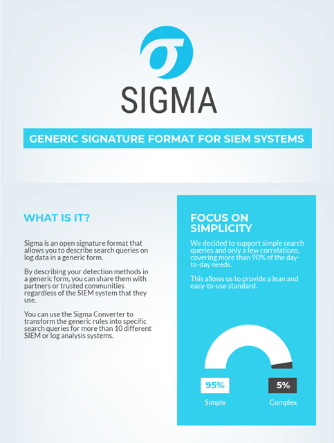

Как выглядит правило Sigma для обнаружения техники ATT&CK T1015, конвертируемое в различные языки запросов? [Вот один из вариантов](https://github.com/Neo23x0/sigma/blob/master/rules/windows/sysmon/sysmon_stickykey_like_backdoor.yml) правила для обнаружения изменения ключей реестра и непосредственного выполнения атаки:
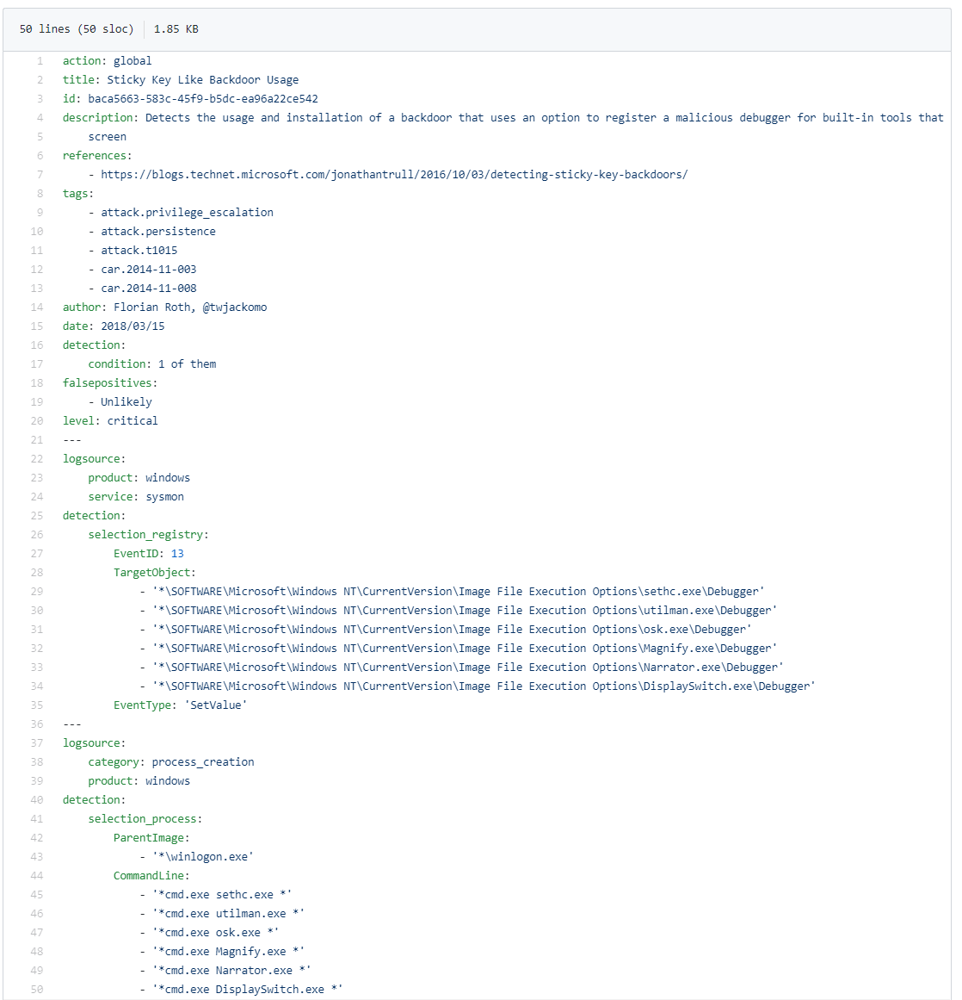

Зачем специалисту ИБ писать запрос в формате Sigma, а не на языке своей системы анализа логов? Есть несколько причин:
* Правило Sigma содержит не только логику обнаружения, но и дополнительный контекст (источники логов, платформы, методы MITRE ATT&CK и т.д.). Логику обнаружения в формате Sigma читать намного легче, чем в большинстве языков запросов, которые предоставляют различные производители. Таким образом, правило само себя документирует, что позволяет проще его объяснять и делиться им. 
* Исследователи зачастую хотят поделиться разработанной логикой обнаружения с сообществом. Sigma упрощает процесс конвертации разработанного метода обнаружения в языки различных SIEM/LM систем, потому что буквально делает это за них. Это способствует дальнейшему распространению идеи с меньшим трудозатратами для всех членов сообщества. Разработчики программного обеспечения могут [предоставлять набор правил Sigma вместе со своим продуктом](https://medium.com/@cyb3rops/an-overlooked-but-intriguing-sigma-use-case-221987f7b588), что поможет специалистам ИБ выявлять наиболее критичные проблемы посредством логов этого продукта (ошибки, аномалии или важные операции, имеющие отношение к безопасности). Исследователи, создавая инструменты для Red Teaming, могут предоставить базовые правила обнаружения реализованных техник проведения атак в формате правил Sigma, чтобы поддержать Purple Teaming.
* В бюллетенях по безопасности стремятся предоставлять информацию, способствующую ускорению работы специалистов ИБ, избегая при этом продвижения конкретных производителей и решений. Формат Sigma в данном направлении может дополнить повсеместно используемые Yara и Snort.

В то время как MITRE ATT&CK предоставляет знания о техниках, применяемых злоумышленниками, Sigma позволяет превратить эти знания в защитные меры, предоставляя способ создания конкретной, само-документированной логики обнаружения атак. Таким образом, эти знания становятся практической, действенной аналитикой.

## Воспроизводимый Анализ

> *"Вы же знакомы с моим методом. Попробуйте применить его." — Артур Конан Дойл, "Знак четырёх"*

Независимо от того, как начинаются расследования, все они включают в себя поиск по данным. Именно поиск является частью анализа, обеспечивающего решение самых сложных задач. Анализ требует ответов на многие вопросы. Какие опорные точки используют для разработки новых версий расследования? Как обогатить данные, чтобы можно было отфильтровать лишнее? Если кто-то исследовал угрозу и описал свои выводы о ней, каковы были его шаги? Как другой исследователь может повторить анализ, проведенный экспертом на аналогичном наборе данных?

Одним из способов повышения доступности анализа может стать раскрытие его сущности и повышение его воспроизводимости. Представьте себе, что лучший в мире специалист по наступательной безопасности мог бы воплотить свои исследовательские ноу-хау таким образом, чтобы другие могли повторить их в своем окружении. Эту задачу нам поможет решить Jupyter Notebook.

### Что такое Jupyter?

Jupyter — это набор взаимодополняющих технологий с открытым исходным кодом, который возник в научных кругах, специализирующихся на научных вычислениях и науке о данных. Вот что нужно знать о нем практикующим специалистам по информационной безопасности:

* Основной компонент — Notebook. Это файл, в котором сочетаются разметка, код и данные. Разметка используется для описания и представления. Notebook может загружать данные из различных источников, осуществлять поиск по ним с помощью команд для анализа данных, а затем визуализировать их с помощью разнообразного набора мощных инструментов визуализации. Notebook обычно пишется на Python (хотя и не обязательно) и опирается на широкий набор библиотек с открытым исходным кодом для обработки данных, таких как Pandas. Помимо простого поиска по данным, Notebook позволяет реализовать проекты в областях науки о данных или машинного обучения. Jupyter является довольно распространенной технологией — только на GitHub насчитывается более 5 миллионов опубликованных Notebook.
* Notebook легко делиться. Поскольку это текстовые файлы, их можно опубликовать где угодно. В том числе на GitHub, поскольку он имеет встроенную поддержку и позволяет визуализировать их для быстрого просмотра. Загрузив чей-то Notebook, можно повторить описанный в нем анализ или применить его к своим данным. Возможность запускать анализ на схожих данных является мощной концепцией доступного представления своей экспертизы. Теперь любой издатель Notebook — это не только учитель, но и член команды исследователей.
* Jupyter Notebook можно запускать где угодно. Для запуска Jupyter Notebook  в веб-браузере требуется "ядро", — программа, которая интерпретирует и выполняет код из Notebook (на Python, .NET и других языках) и возвращает результат в пользовательский интерфейс. Notebook можно запускать практически в любом браузере на Windows, Linux, Mac и мобильных платформах. Ядро может работать локально или удаленно, в вашей инфраструктуре или в облаке, и каждый крупный поставщик облачных вычислений поддерживает их.

### Пример Jupyter Notebook

Notebook состоит из ячеек. Входная ячейка — это ячейка, в которой вводятся команды, а выходная ячейка выдает результат. Давайте рассмотрим конкретный сценарий: Специалист ИБ обнаружил обфусцированную команду PowerShell, посредством сработавшего правила обнаружения. Злоумышленники используют инструменты обфускации, такие как [Magic Unicorn](https://github.com/trustedsec/unicorn), чтобы скрыть вредоносную активность и обойти механизмы обнаружения. [Данный Notebook](https://mybinder.org/v2/gh/JohnLaTwC/Shared/master?filepath=notebooks%2FPowershell%20Shellcode%20Analysis%20with%20CyberChef.ipynb) показывает обработку обфусцированной командной строки, извлечение кодированной Base64 командной строки, ее декодирование и нахождение встроенного шеллкода. Затем он ищет сетевые индикаторы и использует функцию дизассемблирования утилиты [CyberChef](https://gchq.github.io/CyberChef/) для описания функциональности шеллкода:

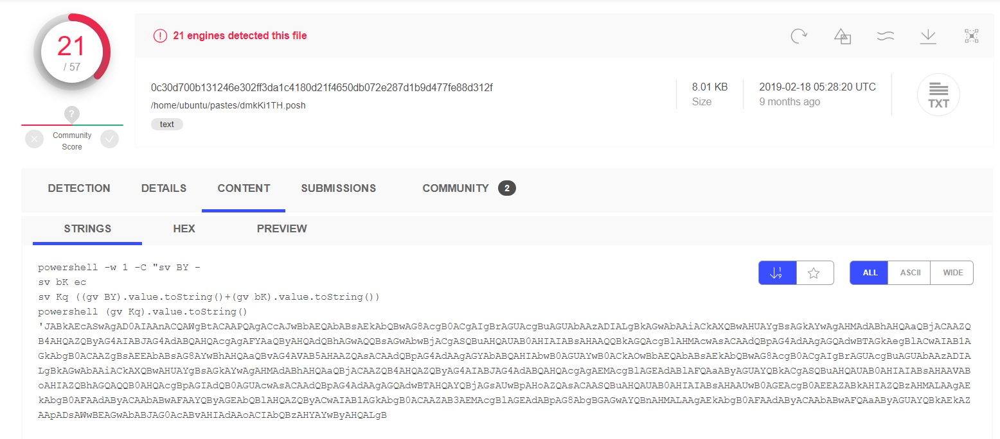 

[Обфусцированная команда PowerShell](https://www.virustotal.com/gui/file/0c30d700b131246e302ff3da1c4180d21f4650db072e287d1b9d477fe88d312f/community), обнаруженная правилом:

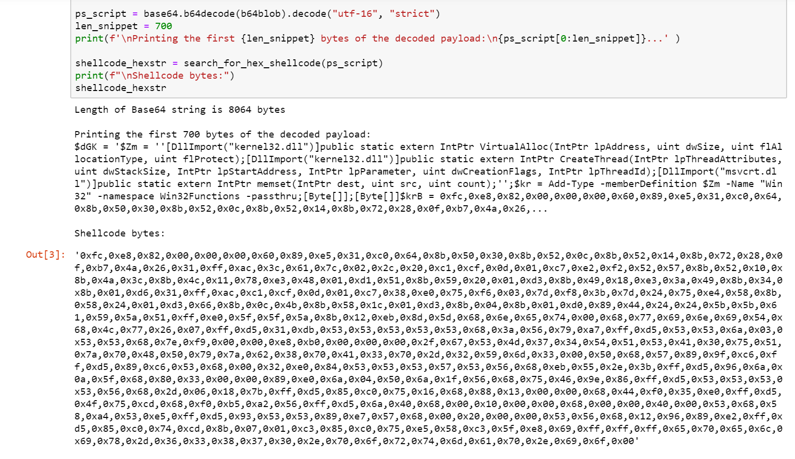 

После декодирования команды Base64, будет найден следующий шеллкод:

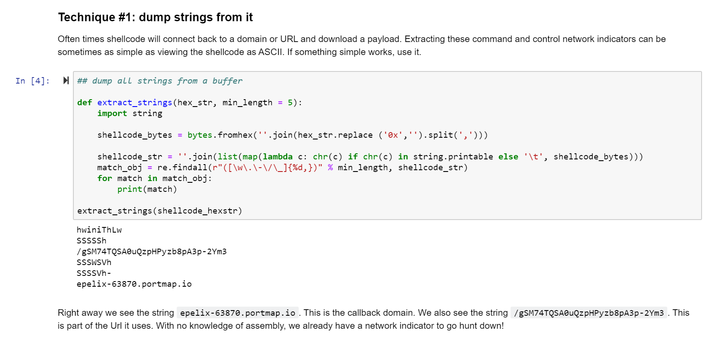

Производим поиск строк, чтобы найти командный домен:

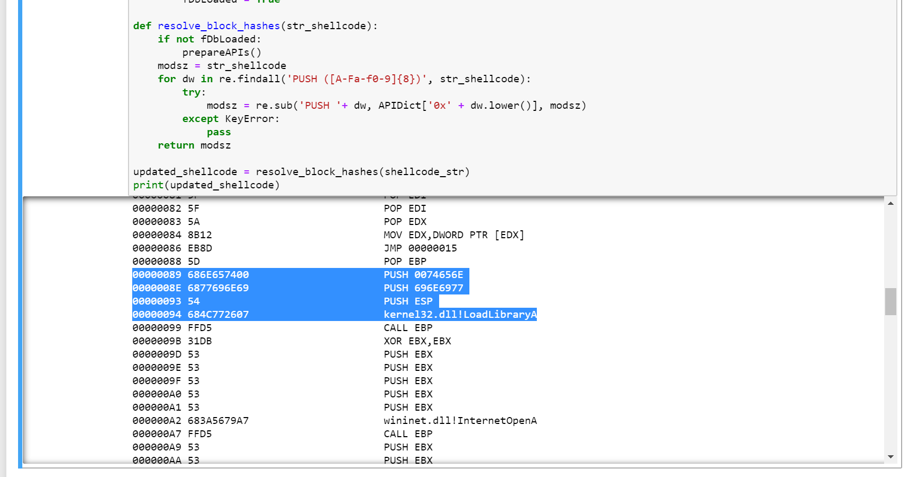 

Дизассемблируем шеллкод и описываем API, чтобы выяснить его функциональность:

 

Итак, шеллкод использует Windows API для подключения к домену (InternetConnectA, HttpSendRequestA, и т.д.) и загрузки команд, которые он запускает напрямую в памяти (VirtualAlloc), что соответствует [описанию](https://github.com/trustedsec/unicorn): "Magic Unicorn — это простой инструмент для использования PowerShell Downgrade Attack и внедрения шеллкода напрямую в память". — Дэйв Кеннеди (Dave Kennedy, [@HackingDave](https://twitter.com/HackingDave)).

Это показывает, что опыт может быть инкапсулирован в Notebook, чтобы другие специалисты могли запускать его на своих данных. Если вы новичок в этом, Роберто Родригез (Roberto Rodriguez) выпустил [серию блогов](https://posts.specterops.io/threat-hunting-with-jupyter-notebooks-part-1-your-first-notebook-9a99a781fde7) о том, как использовать Jupyter Notebook для этих целей. Проект [ThreatHunterPlaybook Project](https://medium.com/threat-hunters-forge/threat-hunter-playbook-mordor-datasets-binderhub-open-infrastructure-for-open-8c8aee3d8b4) помогает начать работу с Jupyter с использованием предварительно подготовленных данных. У Netscylla также есть [блог](https://www.netscylla.com/blog/2019/10/28/Jupyter-Notebooks-for-Incident-Response.html), в котором описано использование Notebook для реагирования на инциденты. Есть несколько Notebook, которые можно запустить через браузер в [этом репозитории](https://github.com/JohnLaTwC/Shared/tree/master/notebooks) на GitHub, на что указывает иконка binder:

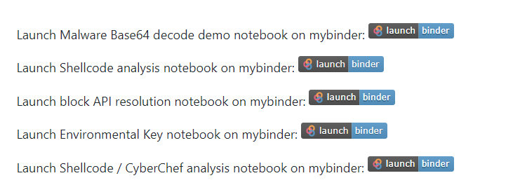

Jupyter поддерживается живой экосистемой профессионалов, работающих в области науки о данных, научных вычислений, машинного обучения, визуализации данных и других областях. Специалисты по информационной безопасности могут опираться на их опыт, адаптируя Jupyter к своим задачам. Jupyter Notebook представляет собой мощный инструмент для инкапсуляции анализа и упрощения его распространения среди других специалистов ИБ.

## Продвижение сообщества

Каждый ключевой элемент упомянутый в этой статье существует благодаря сообществу. Технологии необходимы, но обучение не может происходить без преподавания, а преподавание построено на сотрудничестве. MITRE ATT&CK принимает вклад сообщества, и недавнее обновление, в котором были представлены облачные технологии ([включая Office 365](https://twitter.com/JohnLaTwC/status/1187604286064209921)), было практически полностью получено от сообщества. 

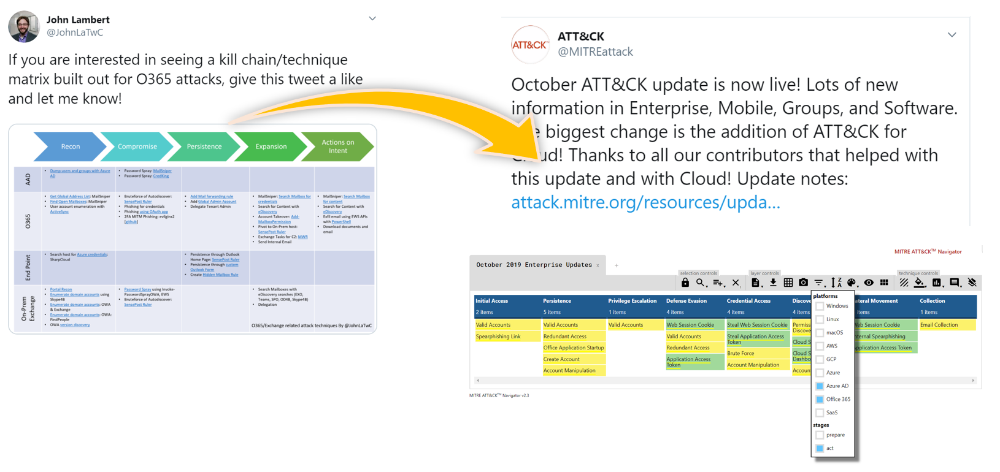 

[Матрица для Office 365](https://twitter.com/JohnLaTwC/status/1126482411900915714) включенная в MITRE ATT&CK:

 

Пример [облачной техники](https://attack.mitre.org/techniques/T1114/), разработанной Швета Прабакаран (Swetha Prabakaran).

Флориан Рот (Florian Roth, [@cyb3rops](https://twitter.com/cyb3rops)) создал [репозиторий с открытым исходным кодом](https://github.com/Neo23x0/sigma/tree/master/rules) для правил Sigma на GitHub. Внести свой вклад в них так же просто, как создать "Pull request" — запрос на включение изменений в репозиторий. Вот пример [Pull Request](https://github.com/Neo23x0/sigma/pull/165) нового правила Sigma:

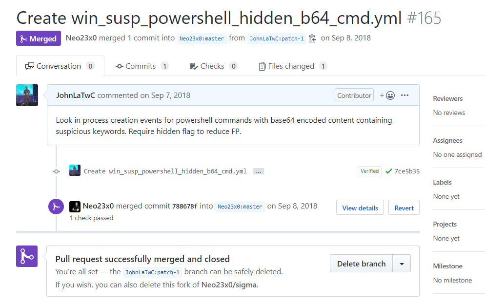

Еще одна активность сообщества — [Open Security Collaborative Development (OSCD)](https://oscd.community/) — открытая международная инициатива специалистов по компьютерной безопасности. Осенью 2019 года прошел двухнедельный спринт, посвященный разработке правил проекта Sigma с целью улучшения покрытия MITRE ATT&CK. Исследователи со всего мира увеличили набор правил репозитория Sigma более чем на 40%:

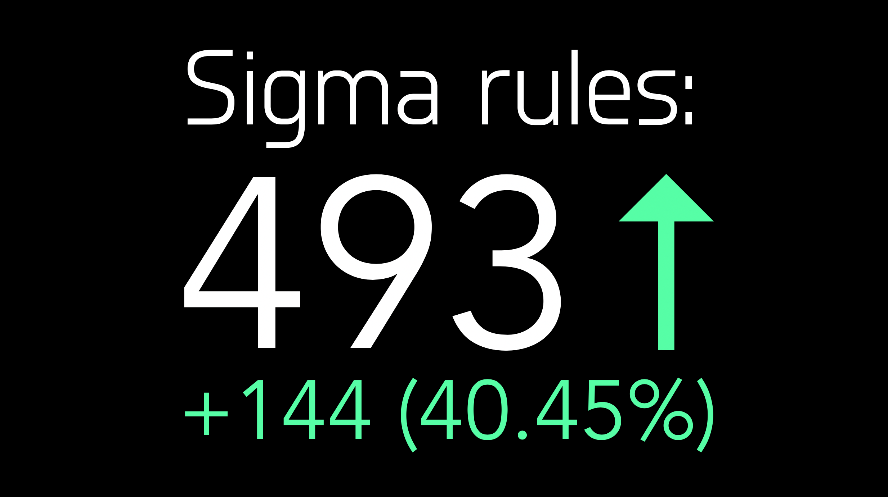

Подробнее об инициативе и прошедшем спринте можно прочитать в [статье на Хабре](https://habr.com/ru/post/482642/).

## Гитхабификация Информационной Безопасности

Слишком часто мы обнаруживаем атаки одновременно, но учимся защищаться в одиночку. В данной статье показано, как подходы к информационной безопасности в рамках глобального сообщества могут ускорить обучение для всех. Представьте себе мир, в котором знания об угрозах хранятся в MITRE ATT&CK. Под каждый сценарий реализации угроз разрабатываются правила Sigma. Срабатывания этих правил обнаружения запускают процесс расследования с применением специально подготовленных Jupyter Notebook.

Если исследователи, публикуя информацию о новой технике, или CERT, предупреждая о новой атаке, будут предоставлять информацию с использованием описанных инструментов, они значительно ускорят процесс ее применения. Если каждая организация будет делиться своим уникальным опытом и опираться на опыт других членов сообщества, существующая разрозненность в информационной безопасности может быть нивелирована благодаря этому тесному взаимодействию, чтобы позволит быть на шаг впереди злоумышленников. Таким образом специалисты ИБ пойдут далеко, потому пойдут вместе.

Что такое Гитхабификация Информационной Безопасности? Это три вещи:

* Это модель использования открытых подходов, которые складываются в  комбинированное обучение и повышение эффективности.
* Это метафора о сотрудничестве, где вклад — это виртуальный "Pull Request"
* Это сайт GitHub.com, на котором есть инструменты для совместной работы. В то время как проекты могут включать в себя концепции Гитхабификации, не размещаясь на GitHub, — он упрощает совместную работу и повышает прозрачность размещенных на нем проектов.

## Заключение и призыв к действию

Благодаря организованному знанию, использованию действенной аналитики, воспроизводимого анализа и поддержке сообщества, специалисты ИБ могут предоставить каждому коллеге возможность учиться у лучших мировых экспертов и сократить время, необходимое для становления экспертом.

Что делать дальше, спросите вы? Вот несколько шагов:

Если вы Специалист ИБ, занимающийся обеспечением защищенности:

* Пишите и применяйте правила [Sigma](https://github.com/Neo23x0/sigma)
* Делитесь правилами в [репозиториях с открытым исходным кодом](https://github.com/Neo23x0/sigma/tree/master/rules/windows/sysmon)
* Поэкспериментируйте с [Jupyter Notebook](https://mybinder.org/v2/gh/JohnLaTwC/Shared/master?filepath=notebooks%2FEnvironmental%20Key%20Login.ipynb) на MyBinder
* Изучите Python на [онлайн-курсах](https://www.pluralsight.com/browse/software-development/python)

Если вы инженер по продуктам безопасности:

* Внедрите поддержку правил Sigma в ваших продуктах, как это [сделала компания JoeSecurity](https://www.joesecurity.org/blog/8225577975210857708)
* Публикуйте Jupyter Notebook, использующие данные из вашего продукта
* Внедряйте поддержку интерфейсов Python для ваших данных

Если исследователь в области безопасности:

* Публикуйте блокноты, демонстрирующие техники
* Вносите правила Sigma в репозитории
* Добавляйте новые техники атак или примеры в [MITRE ATT&CK](https://attack.mitre.org/resources/contribute/)
* Публикуйте наборы данных, полезные для тестирования правил Sigma, такие, как проект [MORDOR](https://github.com/hunters-forge/mordor/)

Если вы менеджер Информационной Безопасности:

* Попросите члена команды изучить эти технологии и поделиться опытом с командой
* Спросите у компаний-партнеров, есть ли у них опыт работы с ATT&CK, Sigma или Jupyter Notebook
* Отправьте членов своей команды на курсы по Python или Jupyter Notebook
* Будучи заказчиком, мотивируйте производителей продуктов и поставщиков сервисов внедрять поддержку MITRE ATT&CK, Sigma и Jupyter Notebook

Если вы из CERT или иной организации, обеспечивающей Информационную Безопасность:

* Публикуйте рекомендации с правилами Sigma
* Указывайте ссылки на техники MITRE ATT&CK в рекомендациях и руководствах

### Благодарности

Автор выражает благодарности Фредди Дизюру ([@FDezeure](https://twitter.com/FDezeure)), Флориану Роту ([@cyb3rops](https://twitter.com/cyb3rops)), Томасу Патцке ([@blubbfiction](https://twitter.com/blubbfiction)), Лие Лизу ([@LeahLease](https://twitter.com/LeahLease)), Тиму Барреллу ([@TimbMsft](https://twitter.com/TimbMsft)), Иэну Хеллену ([@ianhellen](https://twitter.com/ianhellen)) и Роберто Родригезу ([@Cyb3rWard0g](https://twitter.com/Cyb3rWard0g)) за их комментарии к черновикам этого поста.

## Ссылки

* https://attack.mitre.org/
* https://pan-unit42.github.io/playbook_viewer/
* https://mitre-attack.github.io/attack-navigator/enterprise/
* https://atomicredteam.io/testing
* https://cyberwardog.blogspot.com/2017/07/how-hot-is-your-hunt-team.html
* https://yara.readthedocs.io/
* https://github.com/Neo23x0/sigma
* https://uncoder.io/
* https://socprime.com/
* https://jupyter.org/
* https://github.com/parente/nbestimate
* https://mybinder.org/
* https://mybinder.org/v2/gh/parente/nbestimate/master?filepath=estimate.src.ipynb
* https://posts.specterops.io/threat-hunting-with-jupyter-notebooks-part-1-your-first-notebook-9a99a781fde7
* Learn Python: https://www.youtube.com/playlist?list=PLlrxD0HtieHhS8VzuMCfQD4uJ9yne1mE6
* Python development: https://www.pluralsight.com/browse/software-development/python
* https://github.com/nteract/papermill
* https://attack.mitre.org/resources/contribute/
* https://github.com/Neo23x0/signature-base/tree/master/yara
* http://blog.joesecurity.org/2019/10/joe-sandbox-sigma.html
* https://github.com/atc-project/atomic-threat-coverage
* https://medium.com/@cyb3rops/an-overlooked-but-intriguing-sigma-use-case-221987f7b588
* https://www.netscylla.com/blog/2019/10/28/Jupyter-Notebooks-for-Incident-Response.html
* https://github.com/hunters-forge/mordor/
* https://github.com/trustedsec/unicorn
* https://github.com/Microsoft/msticpy
* https://www.joesecurity.org/blog/8225577975210857708
* https://twitter.com/THE_HELK
* MITRE ATT&CKcon 2.0: https://www.youtube.com/playlist?list=PLkTApXQou_8KXWrk0G83QQbNLvspAo-Qk
* https://medium.com/threat-hunters-forge/threat-hunter-playbook-mordor-datasets-binderhub-open-infrastructure-for-open-8c8aee3d8b4
* https://github.com/hunters-forge/ThreatHunter-Playbook

## Планы на будущее

Все технологии, упомянутые в этой статье находятся в стадии развития. Ниже приведен список идей, разработку которых может взять на себя любой член сообщества.

### ATT&CK

* Добавить связи с правилами Sigma и Yara
* Предоставить логи, демонстрирующие [TTP](https://en.wikipedia.org/wiki/Terrorist_Tactics,_Techniques,_and_Procedures), как это сделано в проекте MORDOR
* Задокументировать примеры атак для техник, о которых недостаточно информации в свободном доступе
* Улучшить описание техник с позиции сетевых данных
* Дополнить информацию о способах предотвращения атак

### Sigma

* Добавить поддержку более сложных типов правил, таких как корреляции, объединения (join), агрегирования; увеличить количество примитивов парсинга
* Добавить поддержку графического интерфейса для создания правил и проверки их логики
* Упростить модель данных для распространенных типов событий (так как это сделано, например, для категории "process_creation", которая используется вместо Sysmon Event ID 1 или Windows Event ID 4688)

### Jupyter

* Участвовать в создании библиотек Python для специалистов ИБ
* Улучшить визуализацию для типовых сценариев ИБ: древовидный режим для визуализации цепочки процессов и таймлайн для визуализации активности атакующих
* Функции расстояния для алгоритмов кластеризации распространенных типов данных (IP-адреса, домены, командные строки процессов и т.д.)
* Обобщенный слой доступа к данным, чтобы сделать запросы к системам анализа логов более абстрактными, решить вопросы аутентификации и так далее
